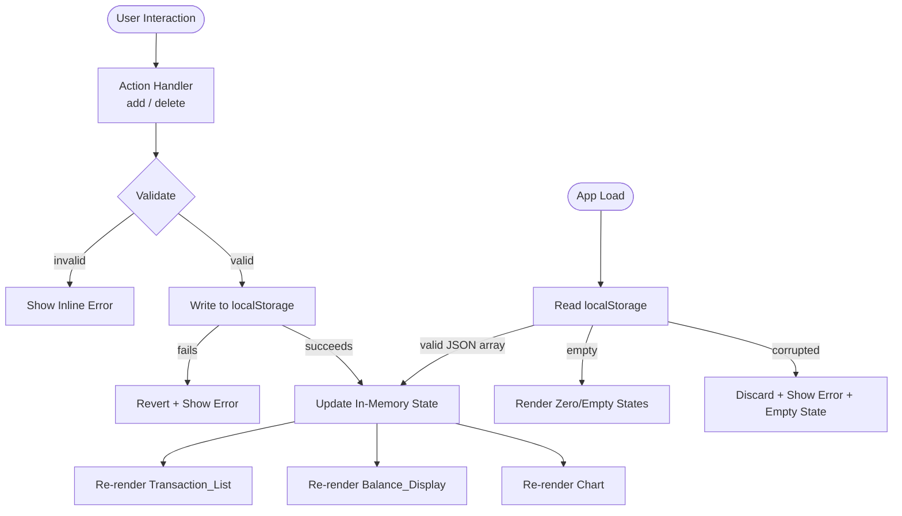

# Design Document: Expense & Budget Visualizer

## Overview

The Expense & Budget Visualizer is a zero-dependency (no build tooling) client-side web app built with plain HTML, CSS, and vanilla JavaScript. It lets users record expenses, view a running total balance, and explore spending by category through a pie chart. All data persists in the browser's `localStorage`.

The architecture is intentionally flat: one HTML entry point, one CSS file, one JS module. There is no routing, no framework, and no server. All rendering is synchronous DOM manipulation triggered by user interactions.

### Key Design Decisions

| Decision | Choice | Rationale |
|---|---|---|
| Chart library | Chart.js v4 via CDN | No build step required; wide browser support; well-maintained |
| Currency formatting | `Intl.NumberFormat` | Native, zero-dependency, handles locale formatting |
| State model | Single in-memory array + localStorage | Simplest model for this scale; avoids stale-state bugs |
| Chart update strategy | `destroy()` + recreate | Avoids Chart.js canvas-reuse errors on repeated updates |
| Error display | Inline DOM banner (auto-dismiss) | No extra dependencies; visible without modal interruption |

---

## Architecture

The app follows a **unidirectional data flow**: user action → state mutation → persist → render.



### File Structure

```
index.html          ← single HTML entry point
css/
  styles.css        ← all visual styles + responsive layout
js/
  app.js            ← all application logic
```

---

## Components and Interfaces

### Input_Form

The HTML `<form>` element with three fields and a submit button.

| Field | Type | Attributes |
|---|---|---|
| `name` | `<input type="text">` | `maxlength="100"`, `required` |
| `amount` | `<input type="number">` | `min="0.01"`, `max="999999999.99"`, `step="0.01"`, `required` |
| `category` | `<select>` | options: `Food`, `Transport`, `Fun` |

**Submit handler** (`handleFormSubmit(event)`):
1. Call `event.preventDefault()`.
2. Run `validateForm(name, amount)` — returns `{ valid: boolean, errors: string[] }`.
3. If invalid: render errors into the inline error container; return.
4. Call `addTransaction({ id, name, amount, category, timestamp })`.
5. Reset form to defaults.

### Transaction_List

A `<ul id="transaction-list">` element. Rendered by `renderTransactionList(transactions)`:
- If `transactions.length === 0`: render single `<li class="empty-state">No transactions yet.</li>`.
- Otherwise: sort descending by `timestamp`, map each to a `<li>` with name, formatted amount, category badge, and a delete `<button data-id="...">`.

### Balance_Display

A `<p id="balance">` or `<div id="balance">` element. Rendered by `renderBalance(transactions)`:
- Computes `sum = transactions.reduce((acc, t) => acc + t.amount, 0)`.
- Formats with `formatCurrency(sum)`.
- Sets element text content.

### Chart

A `<canvas id="spending-chart">` element with an overlay `<div id="chart-no-data">No data</div>` (hidden when data exists).

Rendered by `renderChart(transactions)`:
- Computes per-category totals, excludes categories with zero total.
- If empty: show overlay, skip Chart.js rendering.
- Otherwise: hide overlay, call `chartInstance.destroy()` if it exists, then `new Chart(ctx, config)`.

### Error Banner

A `<div id="error-banner" role="alert" aria-live="assertive">` element, hidden by default. Shown by `showError(message)` and auto-dismissed after 5 seconds.

---

## Data Models

### Transaction Object

```javascript
/**
 * @typedef {Object} Transaction
 * @property {string}  id        - Unique ID (crypto.randomUUID() or Date.now().toString())
 * @property {string}  name      - Item name (1–100 characters, non-whitespace-only)
 * @property {number}  amount    - Positive number in range [0.01, 999999999.99]
 * @property {string}  category  - One of: "Food" | "Transport" | "Fun"
 * @property {number}  timestamp - Unix ms timestamp of creation (Date.now())
 */
```

### localStorage Schema

**Key**: `"expense_transactions"`  
**Value**: JSON-serialized array of `Transaction` objects.

```json
[
  { "id": "1720000000000", "name": "Lunch", "amount": 45000, "category": "Food", "timestamp": 1720000000000 },
  { "id": "1720000001000", "name": "Grab", "amount": 25000, "category": "Transport", "timestamp": 1720000001000 }
]
```

### In-Memory State

```javascript
// Single source of truth in app.js module scope
let transactions = []; // Transaction[]
let chartInstance = null; // Chart | null
```

### Core Functions Interface

```javascript
// Persistence
function loadFromStorage()    // → Transaction[] (throws on quota; returns [] on empty)
function saveToStorage(txns)  // → void (throws on quota error)

// State mutations (each calls saveToStorage before mutating in-memory state)
function addTransaction(tx)       // → void
function deleteTransaction(id)    // → void

// Validation
function validateForm(name, amountStr) // → { valid: boolean, errors: string[] }

// Rendering (pure DOM side-effects, idempotent)
function renderAll(transactions)          // calls the three below
function renderTransactionList(txns)      // → void
function renderBalance(txns)              // → void
function renderChart(txns)                // → void

// Utilities
function formatCurrency(amount)           // → string (e.g. "Rp 45.000")
function buildChartData(txns)             // → { labels: string[], data: number[], colors: string[] }
function showError(message)               // → void
function clearErrors()                    // → void
```

---

## Correctness Properties

*A property is a characteristic or behavior that should hold true across all valid executions of a system — essentially, a formal statement about what the system should do. Properties serve as the bridge between human-readable specifications and machine-verifiable correctness guarantees.*

---

### Property 1: Valid transaction add is a round-trip through storage

*For any* valid transaction (non-empty name ≤ 100 chars, amount in [0.01, 999999999.99], category in {Food, Transport, Fun}), calling `addTransaction` and then reading localStorage should yield an array that contains a transaction with the same name, amount, and category.

**Validates: Requirements 1.2, 5.3**

---

### Property 2: Invalid inputs are always rejected

*For any* combination of invalid inputs — an empty/whitespace-only name, an amount ≤ 0, an amount > 999999999.99, or a missing field — submitting the form should neither add a new transaction to the list nor write a new entry to localStorage.

**Validates: Requirements 1.4**

---

### Property 3: Form resets to defaults after any valid submission

*For any* valid transaction submitted, the form's name field should be empty, the amount field should be empty, and the category dropdown should be set to "Food" immediately after submission.

**Validates: Requirements 1.3**

---

### Property 4: Delete removes exactly the targeted transaction

*For any* non-empty list of transactions, deleting a transaction by its ID should result in: (a) the deleted transaction no longer appears in the DOM, (b) localStorage no longer contains an entry with that ID, and (c) all other transactions remain present and unchanged.

**Validates: Requirements 2.3, 5.3**

---

### Property 5: Transaction list renders with correct content, order, and controls

*For any* non-empty array of transactions, the rendered Transaction_List should contain exactly as many items as the array, each showing the correct name, currency-formatted amount, and category; items should appear in reverse-insertion order (most recent first); and every item should have exactly one delete button.

**Validates: Requirements 2.1, 2.4**

---

### Property 6: Balance always equals the sum of all transaction amounts

*For any* array of transactions (including the empty array), `renderBalance` should display a currency-formatted value equal to the arithmetic sum of all `amount` fields (zero for an empty array).

**Validates: Requirements 3.1, 3.2**

---

### Property 7: Chart data preparation excludes zero-spending categories

*For any* array of transactions, `buildChartData` should return labels and data arrays containing only categories whose total spending is greater than zero, with each data value equal to the exact sum of amounts for that category.

**Validates: Requirements 4.1**

---

### Property 8: Data loading is a round-trip through serialization

*For any* valid array of transactions, serializing it to localStorage via `saveToStorage` and then deserializing it via `loadFromStorage` should produce an array whose entries are deeply equal to the original (same id, name, amount, category, timestamp).

**Validates: Requirements 5.1**

---

## Error Handling

| Scenario | Detection | Response |
|---|---|---|
| Form submitted with empty field | `validateForm` checks truthy/trimmed values | Inline error below offending field; submission blocked |
| Amount ≤ 0 or out of range | `validateForm` numeric bounds check | Inline error on amount field |
| `localStorage.setItem` throws (e.g., `QuotaExceededError`) | `try/catch` around `saveToStorage` | Revert in-memory state change; show error banner; do not update DOM |
| `localStorage.getItem` + `JSON.parse` fails (corrupted data) | `try/catch` around `loadFromStorage` | Discard data; render empty/zero state; show error banner |
| Parsed data is not a valid array | Array.isArray check + item shape validation in `loadFromStorage` | Treated same as corrupted data |
| `crypto.randomUUID` unavailable (very old browser) | Feature-detect, fallback to `Date.now().toString() + Math.random()` | Transparent to user |

### Error Banner Lifecycle

```
showError(msg)
  └─ set textContent + remove 'hidden' class
  └─ setTimeout(5000) → add 'hidden' class
```

Errors from localStorage failures are shown in the banner (not inline), since they are not form-field-specific.

---

## Testing Strategy

### Approach

This feature uses a **dual testing approach**:

- **Unit / example tests**: Cover specific states, edge cases, and error conditions with concrete inputs.
- **Property-based tests**: Verify the 8 correctness properties above across randomly generated inputs.

PBT is appropriate here because the core logic functions (`validateForm`, `buildChartData`, `formatCurrency`, `saveToStorage`/`loadFromStorage`, `renderBalance`) are pure or near-pure functions with clear input → output contracts, and their behavior varies meaningfully across the large input spaces (arbitrary strings, floating-point amounts, varying-length transaction arrays).

### Property-Based Testing Library

Use **[fast-check](https://fast-check.dev/)** (loaded via CDN for tests, or via npm in the test runner context). Each property test is configured to run a **minimum of 100 iterations**.

Tag format for each property test: `// Feature: expense-budget-visualizer, Property N: <property_text>`

### Property Test Outline

| Property | Arbitrary Inputs | Assertion |
|---|---|---|
| P1: Add round-trip | `fc.record({ name: fc.string(1,100), amount: fc.float({min:0.01,max:999999999.99}), category: fc.constantFrom('Food','Transport','Fun') })` | `loadFromStorage()` contains entry with same fields |
| P2: Invalid inputs rejected | `fc.oneof(fc.constant(''), fc.string().filter(s=>!s.trim()), fc.float({max:0}), fc.float({min:1e10}))` | Transaction list length unchanged; localStorage unchanged |
| P3: Form resets after submit | Same as P1 | After submit: name='', amount='', category='Food' |
| P4: Delete removes exactly targeted | `fc.array(validTxArb, {minLength:1}), fc.nat()` (index into array) | Deleted ID absent; others present; localStorage consistent |
| P5: List render correctness | `fc.array(validTxArb, {minLength:1})` | DOM item count = array length; each item content matches; order = reverse timestamp; delete-button count = array length |
| P6: Balance equals sum | `fc.array(validTxArb)` | `formatCurrency(sum)` === displayed balance text |
| P7: Chart data excludes zero categories | `fc.array(validTxArb)` | `buildChartData` labels ⊆ {Food,Transport,Fun}; each value = sum of amounts for that category; no zero-value entries |
| P8: Storage round-trip | `fc.array(validTxArb)` | `loadFromStorage(saveToStorage(txns))` deeply equals original array |

### Unit / Example Tests

- Form structure: fields exist with correct attributes and default values.
- Empty state: zero transactions → empty state message visible; balance shows Rp 0; chart shows "No data" overlay.
- localStorage parse error: corrupted JSON → empty state rendered + error banner shown.
- localStorage write error: `setItem` throws → state unchanged + error banner shown.
- `formatCurrency(0)` → `"Rp 0"` (or locale equivalent zero).
- Responsive layout: CSS `overflow-y` set on list container; media query applies flex-column at < 600 px.
- Typography hierarchy: balance font-size > chart label size > list item font-size.

### Test Configuration

```javascript
// Example property test skeleton (Jest + fast-check)
import fc from 'fast-check';
import { buildChartData, formatCurrency, validateForm } from '../js/app.js';

// Feature: expense-budget-visualizer, Property 7: Chart data preparation excludes zero-spending categories
test('P7: buildChartData excludes zero-spending categories', () => {
  fc.assert(
    fc.property(
      fc.array(validTransactionArbitrary()),
      (txns) => {
        const { labels, data } = buildChartData(txns);
        // No zero values
        data.forEach(v => expect(v).toBeGreaterThan(0));
        // Every label is a valid category
        labels.forEach(l => expect(['Food','Transport','Fun']).toContain(l));
        // Each value equals the sum for its category
        labels.forEach((label, i) => {
          const expected = txns.filter(t => t.category === label)
                               .reduce((s, t) => s + t.amount, 0);
          expect(data[i]).toBeCloseTo(expected, 5);
        });
      }
    ),
    { numRuns: 100 }
  );
});
```
